<!-- markdownlint-disable MD024 -->

# LDAP Change Monitoring with GetChanges

Audience: SOC / Blue Team, identity security engineers, detection engineers  
Format: Markdown source deck  
Slide text language: English  
Speaker transcript: Russian and English  
Assets: each slide has a generated SVG in its numbered folder

> Note: the repository README uses the phrase "persistent search" operationally. In this deck, the implementation is described precisely as Microsoft AD LDAP notification via `DirectoryNotificationControl` / `LDAP_SERVER_NOTIFICATION_OID`, not the expired Netscape/IETF persistent-search draft.

---

## Slide 01 - LDAP Is the AD Control Plane

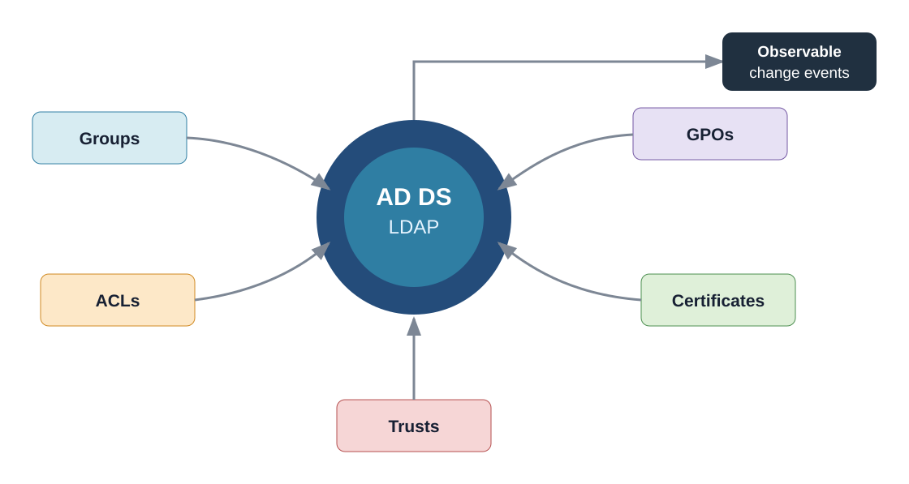

### Slide Text

- Active Directory security state lives behind LDAP.
- Groups, ACLs, GPOs, trusts, certificates, and SPNs are control-plane objects.
- Change monitoring turns identity drift into observable events.

### Speaker Transcript (RU)

Active Directory часто воспринимают как набор учеток и групп, но для защиты это фактически control plane. Через LDAP мы видим группы, ACL, делегирование, GPO, сертификаты, SPN и trust-отношения. Если эти изменения не наблюдаются как события, SOC узнает о них слишком поздно: из инцидента, из повторного дампа или из ручного расследования. Идея GetChanges в том, чтобы перевести важные изменения LDAP-состояния в поток локальных JSON-событий.

### Speaker Transcript (EN)

Active Directory is often treated as a directory of users and groups, but for defenders it is the identity control plane. LDAP exposes groups, ACLs, delegation, GPOs, certificates, SPNs, and trusts. If those changes are not observed as events, the SOC learns about them too late: from an incident, a periodic dump, or manual investigation. GetChanges is about turning important LDAP state changes into local JSON events.

### Visual

Generated locally: [01/visual.svg](01/visual.svg)

### Sources

- Microsoft: [LDAP_SERVER_NOTIFICATION_OID control code](https://learn.microsoft.com/en-us/previous-versions/windows/desktop/ldap/ldap-server-notification-oid)
- Microsoft: [DirectoryNotificationControl Class](https://learn.microsoft.com/en-us/dotnet/api/system.directoryservices.protocols.directorynotificationcontrol)

---

## Slide 02 - Why These Changes Matter

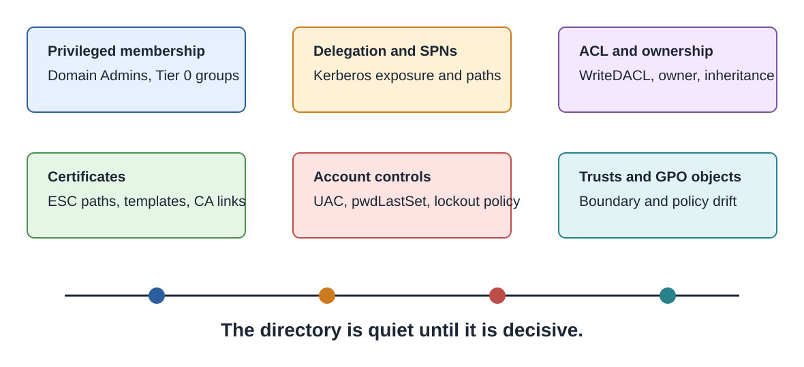

### Slide Text

- Low-volume changes can carry high security impact.
- Privileged membership and ACL edits create direct attack paths.
- Certificates, SPNs, trusts, and account controls reshape authentication.
- The directory is quiet until it is decisive.

### Speaker Transcript (RU)

Событий может быть мало, но цена одного события высокая. Добавление в привилегированную группу, изменение owner или DACL, новый SPN, изменение шаблона сертификата или delegation-флага могут сразу открыть путь к доминированию в домене. Это не шумный endpoint telemetry. Это точечные изменения состояния, которые меняют модель доверия. Поэтому Blue Team нужен канал, который смотрит именно на LDAP-истину, а не только на побочные логи.

### Speaker Transcript (EN)

The event volume can be low, but one event can carry a lot of security meaning. Adding a privileged member, changing owner or DACL, adding an SPN, changing a certificate template, or flipping a delegation-related flag can immediately create a domain attack path. This is not noisy endpoint telemetry. It is state change in the trust model. The Blue Team needs a channel that watches LDAP truth, not only side-effect logs.

### Visual

Generated locally: [02/visual.svg](02/visual.svg)

### Sources

- SpecterOps: [SharpHound CE collection overview](https://bloodhound.specterops.io/collect-data/ce-collection/sharphound)
- Repository code: [LdapEntryParser.cs](../../../GCNet/Ldap/LdapEntryParser.cs) normalizes LDAP attributes into JSON-ready security properties.

---

## Slide 03 - The SOC Visibility Gap

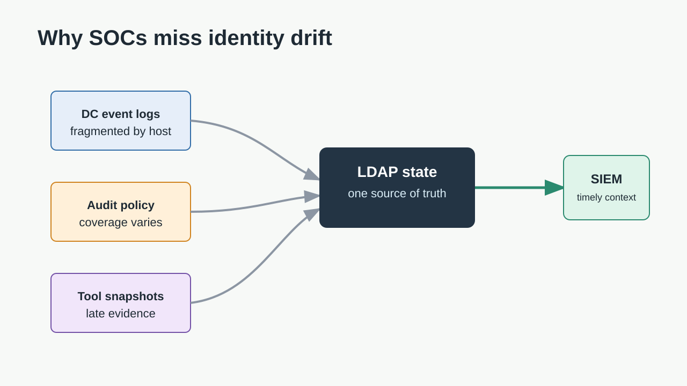

### Slide Text

- Windows audit events are valuable but fragmented.
- Coverage depends on DC, policy, object access, and retention.
- Snapshot tools show state, not the exact moment of drift.
- LDAP state gives defenders a stable reference point.

### Speaker Transcript (RU)

У SOC уже есть Windows events, но они не всегда дают полный и удобный ответ. Политика аудита может отличаться, события распределены по DC, retention ограничен, а часть изменений видна только при правильных SACL или Object Access настройках. Snapshot-инструменты показывают состояние, но не обязательно момент изменения. LDAP monitoring закрывает другой слой: он наблюдает фактическое состояние directory и делает изменение объектом обработки.

### Speaker Transcript (EN)

The SOC already has Windows events, but they do not always give a complete or convenient answer. Audit policy can differ, events are split across DCs, retention is limited, and some changes depend on object access auditing. Snapshot tools show state, but not necessarily the moment of drift. LDAP monitoring covers a different layer: it observes directory state and turns change into something the detection pipeline can process.

### Visual

Generated locally: [03/visual.svg](03/visual.svg)

### Sources

- Microsoft: [Change Notifications in Active Directory Domain Services](https://learn.microsoft.com/en-us/windows/win32/ad/change-notifications-in-active-directory-domain-services)

---

## Slide 04 - Existing Method A: Dump and Diff

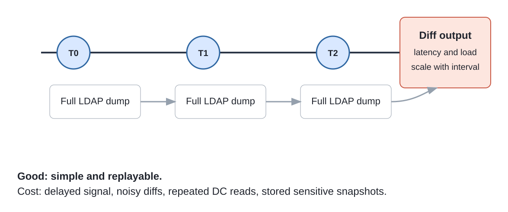

### Slide Text

- Periodically dump LDAP data.
- Compare two snapshots to find changed objects.
- Simple, replayable, and tool-friendly.
- Tradeoffs: latency, DC load, storage, and noisy diffs.

### Speaker Transcript (RU)

Классический подход - периодически выгружать LDAP-данные и сравнивать снимки. Он простой: можно хранить артефакты, пересчитывать diff, отдавать результаты людям или в пайплайн. Но цена понятная: между дампами есть задержка, каждый проход снова читает большой объем данных с DC, нужно хранить чувствительные снимки, а diff часто требует дополнительной нормализации, чтобы отделить важное изменение от формального шума.

### Speaker Transcript (EN)

The classic approach is to periodically dump LDAP data and compare snapshots. It is simple: artifacts can be stored, diffs can be recalculated, and results can be handed to humans or pipelines. The cost is also clear: delay between dumps, repeated DC reads, sensitive snapshot storage, and noisy diffs that need normalization before they become actionable.

### Visual

Generated locally: [04/visual.svg](04/visual.svg)

### Sources

- GitHub: [dirkjanm/ldapdomaindump](https://github.com/dirkjanm/ldapdomaindump)
- Ping Identity: [ldap-diff command-line tool](https://docs.ldap.com/ldap-sdk/docs/tool-usages/ldap-diff.html)
- GitHub: [nxadm/ldifdiff](https://github.com/nxadm/ldifdiff)

---

## Slide 05 - Existing Method B: Sync and Replica Semantics

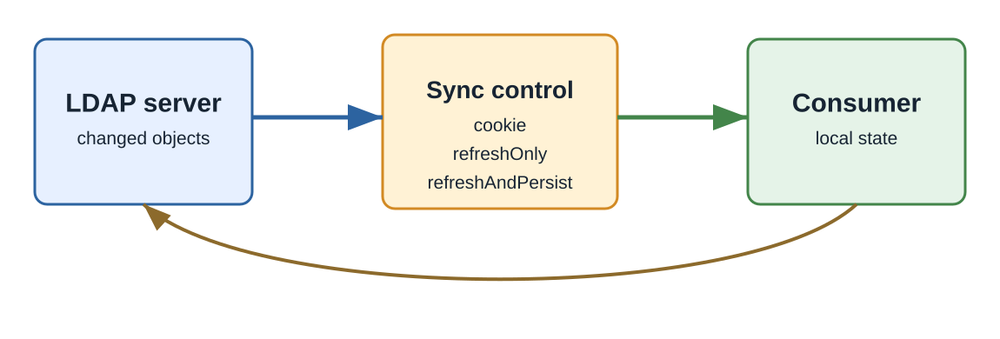

### Slide Text

- Synchronization APIs track changes since a previous state.
- RFC4533 uses cookies and refresh modes for LDAP content sync.
- Microsoft DirSync uses OID `1.2.840.113556.1.4.841`.
- Strong statefulness, higher implementation and operations cost.

### Speaker Transcript (RU)

Другой подход - не сравнивать полные снимки, а поддерживать состояние синхронизации. В LDAP Content Sync из RFC4533 есть cookie и режимы refreshOnly / refreshAndPersist. В AD есть DirSync control с OID `1.2.840.113556.1.4.841`, который возвращает изменения с момента предыдущего поиска. Это мощнее, если мы строим локальную реплику или синхронизатор, но сложнее в эксплуатации: нужно хранить состояние, обрабатывать cookies, edge cases и права.

### Speaker Transcript (EN)

Another approach is not to compare full snapshots, but to maintain synchronization state. LDAP Content Sync in RFC4533 uses cookies and refreshOnly / refreshAndPersist modes. AD also has the DirSync control with OID `1.2.840.113556.1.4.841`, which returns changes since a previous search. This is stronger when we build a local replica or synchronizer, but it is operationally heavier: state, cookies, edge cases, and permissions all matter.

### Visual

Generated locally: [05/visual.svg](05/visual.svg)

### Sources

- RFC Editor: [RFC4533 - LDAP Content Synchronization Operation](https://www.rfc-editor.org/rfc/rfc4533)
- Microsoft: [LDAP DirSync Control](https://learn.microsoft.com/en-us/openspecs/sharepoint_protocols/ms-upsldap/2a836b97-b9c9-4a48-9f3c-4f2af2640a32)
- OpenLDAP: [LDAP Sync Replication](https://www.openldap.org/doc/admin23/syncrepl.html)
- GitHub: [akkornel/syncrepl](https://github.com/akkornel/syncrepl)

---

## Slide 06 - GetChanges Method: Microsoft LDAP Notification

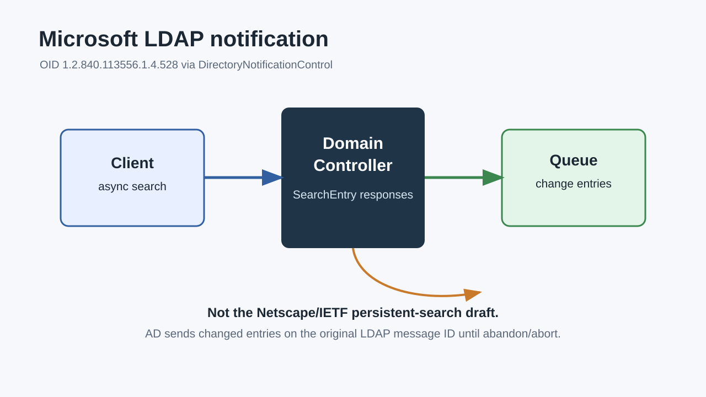

### Slide Text

- AD exposes a notification control for asynchronous LDAP search.
- `LDAP_SERVER_NOTIFICATION_OID` = `1.2.840.113556.1.4.528`.
- .NET wraps it as `DirectoryNotificationControl`.
- Changed objects arrive as partial search results.
- Stop by abandoning or aborting the async request.

### Speaker Transcript (RU)

GetChanges использует не стандартный Persistent Search draft, а Microsoft-механизм LDAP notification. Клиент отправляет asynchronous LDAP search с `DirectoryNotificationControl`. На стороне wire это `LDAP_SERVER_NOTIFICATION_OID`, OID `1.2.840.113556.1.4.528`. DC оставляет операцию открытой и отправляет измененные entries как SearchEntry responses на исходный message ID. В .NET это удобно подключается через `BeginSendRequest` и partial-result callback.

### Speaker Transcript (EN)

GetChanges uses Microsoft LDAP notification, not the standard persistent-search draft. The client sends an asynchronous LDAP search with `DirectoryNotificationControl`. On the wire this is `LDAP_SERVER_NOTIFICATION_OID`, OID `1.2.840.113556.1.4.528`. The DC keeps the operation open and sends changed entries as SearchEntry responses on the original message ID. In .NET, this maps cleanly to `BeginSendRequest` and a partial-result callback.

### Visual

Generated locally: [06/visual.svg](06/visual.svg)

### Sources

- Microsoft: [LDAP_SERVER_NOTIFICATION_OID control code](https://learn.microsoft.com/en-us/previous-versions/windows/desktop/ldap/ldap-server-notification-oid)
- Microsoft: [DirectoryNotificationControl Class](https://learn.microsoft.com/en-us/dotnet/api/system.directoryservices.protocols.directorynotificationcontrol)
- IETF draft for contrast: [draft-ietf-ldapext-psearch-03](https://datatracker.ietf.org/doc/html/draft-ietf-ldapext-psearch-03)

---

## Slide 07 - Repository and Tooling Structure

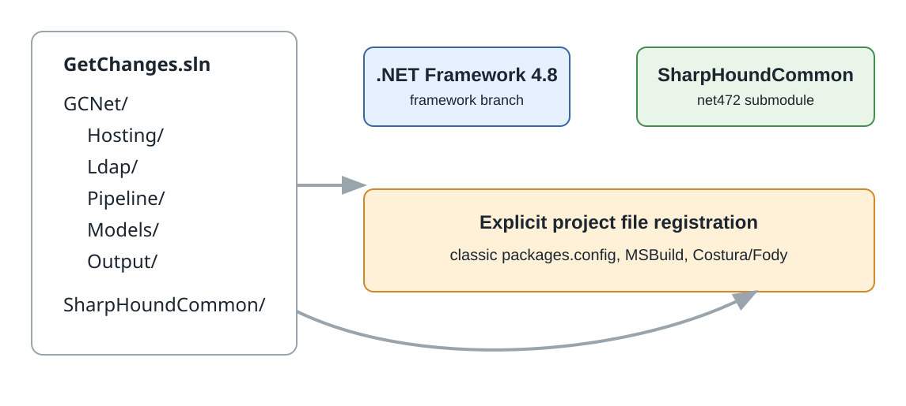

### Slide Text

- `GCNet` is the primary console monitor.
- Branch `framework` targets .NET Framework 4.8.
- Source folders map to responsibilities, not nested namespaces.
- `SharpHoundCommon` is consumed as a submodule/project reference.
- Classic `packages.config` restore requires `nuget.exe`.

### Speaker Transcript (RU)

Репозиторий на ветке `framework` оставлен под .NET Framework 4.8 для окружений, где нельзя использовать современный .NET. Основное приложение - `GCNet`. Папки разделяют ответственность: `Hosting`, `Ldap`, `Pipeline`, `Models`, `Output`, но namespace остается плоским `GCNet`. Важный элемент - submodule `SharpHoundCommon`: проект ссылается на common library и использует уже готовые LDAP property processors.

### Speaker Transcript (EN)

The `framework` branch stays on .NET Framework 4.8 for environments that cannot run modern .NET. The main application is `GCNet`. Folders separate responsibilities: `Hosting`, `Ldap`, `Pipeline`, `Models`, and `Output`, while the namespace remains flat as `GCNet`. A key part is the `SharpHoundCommon` submodule: the project references the common library and uses existing LDAP property processors.

### Visual

Generated locally: [07/visual.svg](07/visual.svg)

### Sources

- Repo docs: [AGENTS.md](../../../AGENTS.md)
- Project target: [GCNet/GetChanges.csproj](../../../GCNet/GetChanges.csproj#L12)
- SharpHound project reference: [GCNet/GetChanges.csproj](../../../GCNet/GetChanges.csproj#L263)
- GitHub: [SpecterOps/SharpHoundCommon](https://github.com/SpecterOps/SharpHoundCommon)

---

## Slide 08 - PoC Architecture

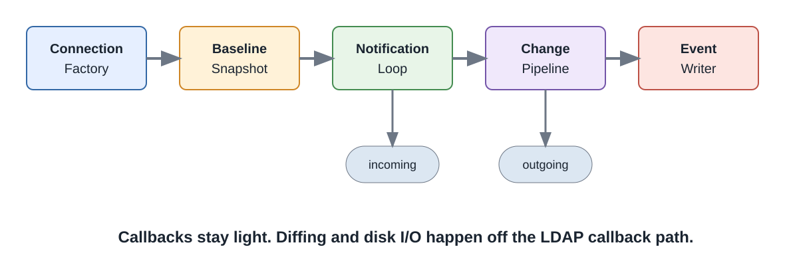

### Slide Text

- Connection factory selects and binds to a DC.
- Optional baseline snapshot loads tracked attributes.
- Notification loop feeds an incoming queue.
- Change pipeline filters, enriches, and emits JSON-ready events.
- File writer serializes one event per JSON file.

### Speaker Transcript (RU)

Архитектура PoC намеренно небольшая. `ChangeMonitorApplication` валидирует options, выбирает base DN, загружает ignore list, при необходимости делает baseline snapshot, потом запускает pipeline, writer и notification loop. Notification loop кладет `ChangeEvent` во входящую очередь. Pipeline решает, нужно ли писать событие, добавляет diff и metadata enrichment. Writer сохраняет результат отдельным JSON-файлом.

### Speaker Transcript (EN)

The PoC architecture is intentionally small. `ChangeMonitorApplication` validates options, resolves the base DN, loads the ignore list, optionally loads the baseline snapshot, then starts the pipeline, writer, and notification loop. The notification loop adds `ChangeEvent` items to the incoming queue. The pipeline decides whether the event should be written, adds diffs and metadata enrichment, and the writer stores one JSON file per qualified event.

### Visual

Generated locally: [08/visual.svg](08/visual.svg)

### Sources

- Orchestrator flow: [GCNet/Hosting/ChangeMonitorApplication.cs](../../../GCNet/Hosting/ChangeMonitorApplication.cs#L41)
- Pipeline startup: [GCNet/Hosting/ChangeMonitorApplication.cs](../../../GCNet/Hosting/ChangeMonitorApplication.cs#L81)
- Writer loop: [GCNet/Hosting/ChangeMonitorApplication.cs](../../../GCNet/Hosting/ChangeMonitorApplication.cs#L122)

---

## Slide 09 - Code Keypoint: Subscription Loop

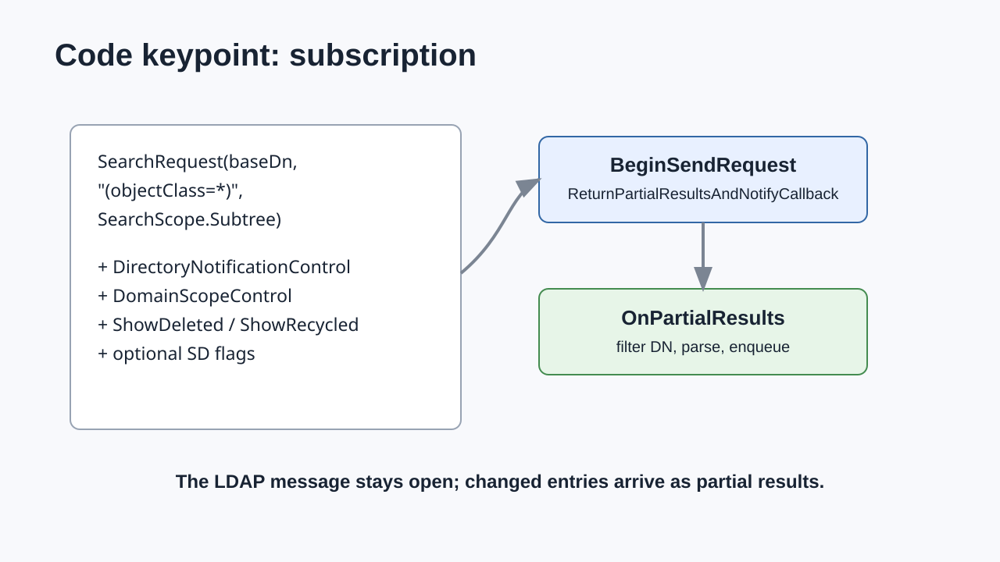

### Slide Text

- `BuildNotificationRequest` creates a subtree search over `(objectClass=*)`.
- It adds `DirectoryNotificationControl` and AD-specific controls.
- `BeginSendRequest` uses `ReturnPartialResultsAndNotifyCallback`.
- `OnPartialResults` filters DNs, parses entries, and enqueues `ChangeEvent`.
- Recoverable LDAP failures trigger reconnect with capped backoff and DC rediscovery.

### Speaker Transcript (RU)

Ключевой кусок находится в `LdapNotificationLoopService`. Request строится как subtree search по `(objectClass=*)`, затем добавляется `DirectoryNotificationControl`, `DomainScopeControl` и дополнительные AD controls. Подписка стартует через `BeginSendRequest` с `PartialResultProcessing.ReturnPartialResultsAndNotifyCallback`. Callback получает partial results, отбрасывает ignored DNs, парсит entry и кладет `ChangeEvent` в очередь. При recoverable LDAP ошибках loop пересоздает session и сбрасывает cached DC.

### Speaker Transcript (EN)

The key part lives in `LdapNotificationLoopService`. The request is a subtree search over `(objectClass=*)`, then it adds `DirectoryNotificationControl`, `DomainScopeControl`, and additional AD controls. The subscription starts through `BeginSendRequest` with `PartialResultProcessing.ReturnPartialResultsAndNotifyCallback`. The callback receives partial results, drops ignored DNs, parses the entry, and adds a `ChangeEvent` to the queue. On recoverable LDAP errors, the loop recreates the session and resets the cached DC.

### Visual

Generated locally: [09/visual.svg](09/visual.svg)

### Sources

- Subscription start: [GCNet/Ldap/LdapNotificationLoopService.cs](../../../GCNet/Ldap/LdapNotificationLoopService.cs#L155)
- Partial result callback: [GCNet/Ldap/LdapNotificationLoopService.cs](../../../GCNet/Ldap/LdapNotificationLoopService.cs#L187)
- Notification control: [GCNet/Ldap/LdapNotificationLoopService.cs](../../../GCNet/Ldap/LdapNotificationLoopService.cs#L249)
- Reconnect behavior: [GCNet/Ldap/LdapNotificationLoopService.cs](../../../GCNet/Ldap/LdapNotificationLoopService.cs#L272)

---

## Slide 10 - Code Keypoint: SharpHound Parsing

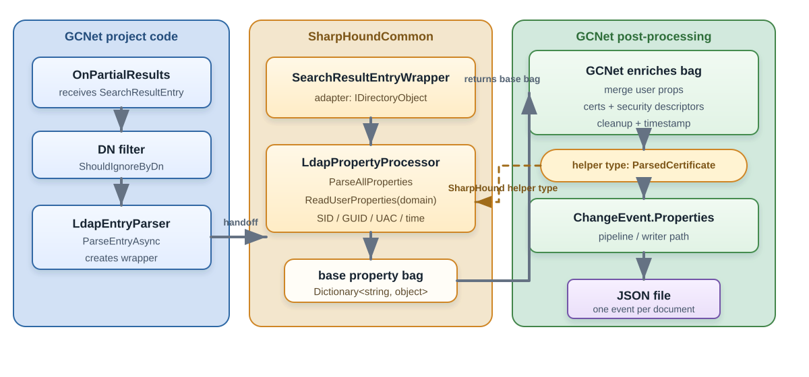

### Slide Text

- `LdapEntryParser` wraps `SearchResultEntry` for SharpHoundCommon.
- `LdapPropertyProcessor` parses common AD properties.
- User properties are read with current-domain context.
- Certificates and security descriptors are normalized for stable JSON.
- This keeps output close to BloodHound-oriented semantics.

### Speaker Transcript (RU)

Здесь ценность submodule особенно заметна. Вместо того чтобы заново писать AD parser, `LdapEntryParser` оборачивает `SearchResultEntry` в `SearchResultEntryWrapper` и передает его в `LdapPropertyProcessor`. Затем он добавляет user properties, сертификаты, security descriptors и служебные поля вроде distinguishedName и timestamp. Для `nTSecurityDescriptor` бинарный blob превращается в SDDL, что важно для стабильного diff. Это не означает прямой импорт в BloodHound, но означает совместимую модель нормализации.

### Speaker Transcript (EN)

This is where the submodule pays off. Instead of writing another AD parser, `LdapEntryParser` wraps `SearchResultEntry` in `SearchResultEntryWrapper` and passes it to `LdapPropertyProcessor`. It then adds user properties, certificates, security descriptors, and metadata fields such as distinguishedName and timestamp. For `nTSecurityDescriptor`, the binary blob becomes SDDL, which is important for stable diffing. This does not mean direct BloodHound import, but it does mean compatible normalization semantics.

### Visual

Generated locally: [10/visual.svg](10/visual.svg)

### Sources

- Processor construction: [GCNet/Ldap/LdapEntryParser.cs](../../../GCNet/Ldap/LdapEntryParser.cs#L33)
- SharpHound property parsing: [GCNet/Ldap/LdapEntryParser.cs](../../../GCNet/Ldap/LdapEntryParser.cs#L56)
- Security descriptor normalization: [GCNet/Ldap/LdapEntryParser.cs](../../../GCNet/Ldap/LdapEntryParser.cs#L99)
- SpecterOps: [SharpHound CE](https://bloodhound.specterops.io/collect-data/ce-collection/sharphound)

---

## Slide 11 - Telemetry Semantics: Baseline and Diff

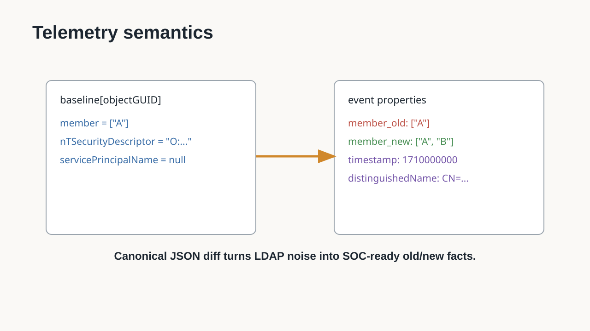

### Slide Text

- Tracked attributes activate an initial baseline snapshot.
- Values are compared as canonical JSON.
- Real changes emit `{attribute}_old` and `{attribute}_new`.
- Unchanged notifications are suppressed.
- Optional replication metadata adds AD provenance context.

### Speaker Transcript (RU)

LDAP notification говорит: объект изменился. Для SOC этого мало, потому что нужно понять, изменился ли интересующий атрибут. Поэтому при `--tracked-attributes` GetChanges загружает baseline snapshot, а потом сравнивает canonical JSON по каждому tracked attribute. Если значение реально изменилось, в событии появляются пары `attribute_old` и `attribute_new`. Если notification пришла, но tracked attributes не поменялись, событие подавляется. При `--enrich-metadata` можно добавить `msDS-ReplAttributeMetaData`.

### Speaker Transcript (EN)

LDAP notification says that an object changed. For a SOC, that is not enough, because we need to know whether the attribute we care about changed. With `--tracked-attributes`, GetChanges loads a baseline snapshot, then compares canonical JSON for each tracked attribute. If the value really changed, the event emits `attribute_old` and `attribute_new`. If the notification arrives but tracked attributes did not change, the event is suppressed. With `--enrich-metadata`, `msDS-ReplAttributeMetaData` can be added.

### Visual

Generated locally: [11/visual.svg](11/visual.svg)

### Sources

- Baseline snapshot paging: [GCNet/Pipeline/BaselineSnapshotLoader.cs](../../../GCNet/Pipeline/BaselineSnapshotLoader.cs#L54)
- Tracked attribute decision: [GCNet/Pipeline/ChangeProcessingPipeline.cs](../../../GCNet/Pipeline/ChangeProcessingPipeline.cs#L80)
- Old/new diff emission: [GCNet/Pipeline/ChangeProcessingPipeline.cs](../../../GCNet/Pipeline/ChangeProcessingPipeline.cs#L115)
- Event writer: [GCNet/Output/EventFileWriter.cs](../../../GCNet/Output/EventFileWriter.cs#L29)

---

## Slide 12 - Demo and Blue Team Outcome

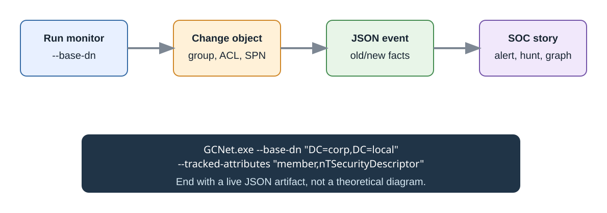

### Slide Text

- Run the monitor against a lab base DN.
- Mutate a high-value object: group membership, ACL, SPN, or certificate-related attribute.
- Observe one JSON event with normalized properties and old/new values.
- Feed the event into SIEM, hunting notebooks, or a BloodHound-oriented graph workflow.
- Next step: validate direct graph import or build a converter.

### Speaker Transcript (RU)

Демо лучше строить вокруг одного понятного изменения. Запускаем `GCNet.exe --base-dn "DC=corp,DC=local" --tracked-attributes "member,nTSecurityDescriptor"`, затем меняем членство группы или DACL тестового объекта. На выходе показываем JSON: distinguishedName, timestamp, нормализованные свойства и `_old` / `_new`. Важно не обещать прямой BloodHound import, пока он не проверен. Правильная формулировка: GetChanges уже использует SharpHoundCommon normalization, поэтому может стать источником для BloodHound-oriented graph workflow через converter или отдельный import path.

### Speaker Transcript (EN)

The demo should focus on one understandable change. Run `GCNet.exe --base-dn "DC=corp,DC=local" --tracked-attributes "member,nTSecurityDescriptor"`, then change group membership or a test object's DACL. The output is a JSON file with distinguishedName, timestamp, normalized properties, and `_old` / `_new` values. It is important not to claim direct BloodHound import until that is verified. The precise claim is that GetChanges already uses SharpHoundCommon normalization, so it can feed a BloodHound-oriented graph workflow through a converter or dedicated import path.

### Visual

Generated locally: [12/visual.svg](12/visual.svg)

### Sources

- CLI options: [GCNet/Hosting/Options.cs](../../../GCNet/Hosting/Options.cs)
- Build and run instructions: [README.md](../../../README.md#L25)
- SharpHoundCommon reference: [GCNet/GetChanges.csproj](../../../GCNet/GetChanges.csproj#L263)

---

## Appendix - Source Map

### Official Protocol and Platform Sources

- Microsoft: [LDAP_SERVER_NOTIFICATION_OID control code](https://learn.microsoft.com/en-us/previous-versions/windows/desktop/ldap/ldap-server-notification-oid)
- Microsoft: [Change Notifications in Active Directory Domain Services](https://learn.microsoft.com/en-us/windows/win32/ad/change-notifications-in-active-directory-domain-services)
- Microsoft: [DirectoryNotificationControl Class](https://learn.microsoft.com/en-us/dotnet/api/system.directoryservices.protocols.directorynotificationcontrol)
- Microsoft: [LDAP DirSync Control](https://learn.microsoft.com/en-us/openspecs/sharepoint_protocols/ms-upsldap/2a836b97-b9c9-4a48-9f3c-4f2af2640a32)
- RFC Editor: [RFC4533 - LDAP Content Synchronization Operation](https://www.rfc-editor.org/rfc/rfc4533)
- IETF Datatracker: [draft-ietf-ldapext-psearch-03](https://datatracker.ietf.org/doc/html/draft-ietf-ldapext-psearch-03)

### Comparative Tools

- GitHub: [dirkjanm/ldapdomaindump](https://github.com/dirkjanm/ldapdomaindump)
- Ping Identity: [ldap-diff command-line tool](https://docs.ldap.com/ldap-sdk/docs/tool-usages/ldap-diff.html)
- GitHub: [nxadm/ldifdiff](https://github.com/nxadm/ldifdiff)
- OpenLDAP: [LDAP Sync Replication](https://www.openldap.org/doc/admin23/syncrepl.html)
- GitHub: [akkornel/syncrepl](https://github.com/akkornel/syncrepl)

### Repository Code Anchors

- [GCNet/Hosting/ChangeMonitorApplication.cs](../../../GCNet/Hosting/ChangeMonitorApplication.cs) - top-level orchestration, lifecycle, pipeline and writer wiring.
- [GCNet/Ldap/LdapNotificationLoopService.cs](../../../GCNet/Ldap/LdapNotificationLoopService.cs) - notification request, `BeginSendRequest`, partial results, reconnect logic.
- [GCNet/Ldap/LdapEntryParser.cs](../../../GCNet/Ldap/LdapEntryParser.cs) - SharpHoundCommon integration and security descriptor normalization.
- [GCNet/Pipeline/BaselineSnapshotLoader.cs](../../../GCNet/Pipeline/BaselineSnapshotLoader.cs) - initial baseline for tracked attributes.
- [GCNet/Pipeline/ChangeProcessingPipeline.cs](../../../GCNet/Pipeline/ChangeProcessingPipeline.cs) - canonical diff and `_old` / `_new` emission.
- [GCNet/Output/EventFileWriter.cs](../../../GCNet/Output/EventFileWriter.cs) - one JSON file per qualified event.
- [GCNet/GetChanges.csproj](../../../GCNet/GetChanges.csproj) - .NET Framework 4.8 target and SharpHoundCommon project reference.

### Asset Attribution

All slide visuals in `01/` through `12/` are generated locally for this deck and have no external image licensing dependency.
